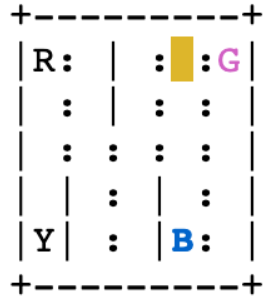

这里使用的是 OpenAI Taxi-V3 环境

这里有 4 个地点，分别用 4 个字母表示，任务是要从一个地点接上乘客，送到另外 3 个中的一个放下乘客，越快越好。

成功运送一个客人获得 20 分奖励

每走一步损失 1 分（希望尽快送到目的地）

没有把客人放到指定的位置，损失 10 分

渲染图中显示，一共 R，G，B，Y 这 4 个地点，黄色的块是 taxi，其中 ":" 栅栏可以穿越，"|" 栅栏不能穿越

红色显示的就是有乘客的地方，蓝色显示的就是乘客的目的地